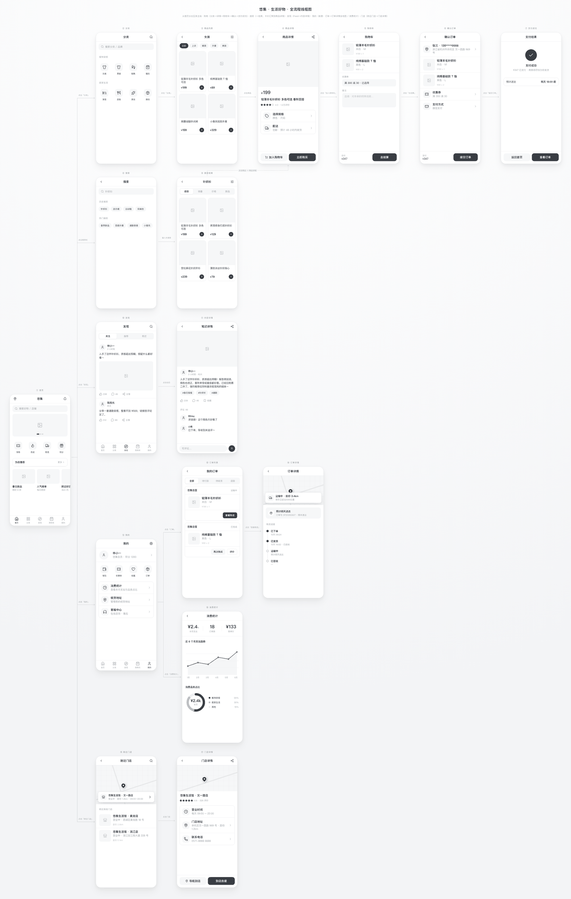

# Easy Wireframe · 移动端原型 / 页面流程线框图


一个适配 Claude Code / Codex 等 Agent 环境的 Skill：把"想做什么 App、有哪几页、怎么点击流转"变成一张协调、专业的**移动端线框流程图**——多个 iPhone 尺寸(375×812)页面横向平铺，箭头标注页面间跳转。产出是**零依赖的单文件 HTML**。



> 上图为内置黄金样例 `example.html` 的实际产出：17 个 iPhone 页面平铺，首页分出 5 条主线，含嵌套子分叉与跨页汇聚连线。

## 风格定位

- **移动端线框**：iPhone 逻辑尺寸 375×812 的页面卡片，无手机壳、无状态栏，干净。
- **极简黑白灰**：一套冷白灰 + 近黑文字，无彩色。
- **iOS / Apple HIG 标准**：尺寸、字号、图标都按设计系统锁定。
- **平铺 + 箭头**：所有页面横排，两页之间用箭头说明"点击了什么 → 到哪一页"。

---

## 30 秒开始

```bash
npx skills add https://github.com/teo5777/easy-wireframe --skill easy-wireframe
```

也可以直接把这段话发给有 shell 权限的 AI Agent：

```text
帮我安装 easy-wireframe。请把 https://github.com/teo5777/easy-wireframe 克隆到 ~/.claude/skills/easy-wireframe，安装完成后检查 SKILL.md、design-system.md、components.md、template.html、example.html 是否存在。
```

已经安装过的话，**按你当初的安装方式**更新：

```bash
# ① 用上面的 npx skills 装的 —— 直接用 CLI 更新（推荐）
npx skills update easy-wireframe
# 更新全部已装 skill：npx skills update（别名 npx skills upgrade）
```

```bash
# ② 手动 git clone 到本地 skills 目录装的 —— 进入你 clone 的目录 git pull
cd <你当初 clone 的目录>   # 例如 ~/.claude/skills/easy-wireframe
git pull
```

> 注意：`npx skills add` 装出来的副本由 `skills` CLI 托管（通常在 `~/.agents/skills/` 并软链接给各 Agent），**不是你的 git 工作区**，对它执行 `git pull` 不会生效——这种情况一律用 `npx skills update`。

或者把这段话发给有 shell 权限的 AI Agent，让它替你更新：

```text
帮我更新 easy-wireframe skill。优先执行 npx skills update easy-wireframe；如果它不是用 skills CLI 装的、而是手动 git clone 的，就进入该 clone 目录执行 git pull。完成后告诉我当前最新 commit。
```

安装后直接对 Agent 说：

```text
帮我做一个外卖 App 的原型，大概 5 个页面，从首页点进商家、加购物车、下单、支付。
```

也可以试这些请求：

```text
把这个登录流程做成线框图：启动页 → 登录页 → 验证码页 → 首页。
帮我做一个习惯打卡 App，首页分别能进入「查看习惯」和「新建习惯」两条线。
给我的健身 App 加一个数据统计页，要有三栏数字摘要、进度条和柱状图。
```

## 文件说明

| 文件 | 内容 |
|---|---|
| `SKILL.md` | Skill 清单与工作流（生成原型的权威流程，入口文件） |
| `design-system.md` | 颜色 / 字号(HIG 映射) / 尺寸 / 图标 / 箭头 的权威数值表 |
| `template.html` | 骨架文件：已含全部 CSS + 标注 JS + 截图 JS，复制后填充 `.flow` |
| `components.md` | 可复制的 HTML 积木：导航栏 / 列表 / 对话 / 统计 / 箭头 / 分支 / 跨页连线 / 30+ 扩展组件 |
| `example.html` | 黄金样例（悠集·生活好物，17 页全流程电商 App），演示全部组件 + 嵌套分叉 + 跨页汇聚连线，适合直接用于宣发 |

## 效果

- 📱 **移动端线框流程图**：多个 iPhone 尺寸页面横向平铺，箭头标注页面间跳转
- 🎨 **极简黑白灰 + Apple HIG**：尺寸、字号、图标按设计系统锁定，真机宽度下短文案不折行
- 🧩 **丰富组件库**：导航栏 / 列表 / 对话 / 底部 Tab / 卡片 / 九宫格 / 横滑 / Banner / 商品卡 / Feed / 表单 / 时间线 / 空状态 / 地图 / 柱状·折线·圆环图 等 30+ 形态，复制即用
- 🔀 **分支布局**：一个页面分出多条路线时自动绘制折线 + 箭头 + 标注，支持**嵌套子分叉**
- 🔗 **跨页连线**：非相邻页面相连、多个入口汇聚到同一页面，自动绘制跨页折线
- 🛟 **图标永不空白**：图标 CDN 失败时右下角浮现「一键修复」入口，复制指令发给 AI 即转为内联 SVG（默认零打扰）
- 📌 **标注改图闭环**：在图上点一下写想法，一键导出成「带页面名 + 精确坐标」的指令文本，回贴给 AI 就能精准改图 —— 详见下方 [✨ 招牌功能](#-招牌功能边看边标一键导出改图闭环)
- 🖼 **整页截图**：用 html2canvas 导出 2× 高清 PNG，横向溢出视口的页面也会完整拍下
- 🔍 **画布缩放**：工具栏按钮 / `Ctrl ⌘ + 滚轮` / Mac 触控板捏合 / 「适应屏幕」灵活放大缩小看细节，缩放时布局不变形、连线不错位
- ✋ **空格拖动画布**：像 Figma 一样，按住 `空格` 拖拽即可平移视图查看大图，松开恢复
- ✏️ **可编辑标题**：大标题 / 副标题点击即改，失焦保存
- 📄 **单文件 HTML**：不需要构建、不需要服务器，浏览器直接打开

## ✨ 招牌功能：边看边标，一键导出「改图闭环」

线框图最大的痛点不是画，而是**画完之后怎么改**——你得对着图跟 AI 描述"第二个页面那个按钮往上挪、第三页标题改一下"，费劲又容易说不清。

Easy Wireframe 生成的 HTML 内置了一套**标注 → 导出 → 回贴改图**的闭环，把这件事变得极其顺手：

1. **点开「标注模式」** —— 右上角工具栏一个按钮，开启后任意页面变成可点击。
2. **在要改的地方点一下** —— 落一个图钉，弹窗里直接写你的想法（"这里加个搜索框""这页改成深色"）。想标几处标几处，跨页面都行。
3. **点「导出标注」** —— 自动生成一段结构化文本并复制到剪贴板，长这样：

   ```text
   我在原型页面上做了如下标注，请据此更新 prototype.html：

   [#1] 页面：首页 | 锚点：「景区伴游」入口 | 位置：62%,40%
        想法：这里加一个搜索框
   [#2] 页面：设置页 | 锚点：语音播报开关 | 位置：85%,30%
        想法：默认改成关闭
   ```

4. **回贴给 AI** —— 把这段直接发给我（或任何 Agent），就能**精准定位到哪一页、哪个位置、要改什么**，不用再用嘴描述。

**为什么比一般线框工具方便：**

- 🎯 **定位精确**：每条标注自带页面名、锚点元素和百分比坐标，AI 不会改错地方。
- 🔁 **改图即对话**：导出文本开头就是一句现成的指令，复制粘贴即可，零格式整理。
- 💾 **断点续标**：标注存在浏览器 localStorage，按文件名隔离——关掉网页再打开，标注还在；每个新原型都是干净状态，不串用。
- 🧹 **零负担**：留空的标注收起时自动删除，弹窗里有明确的删除按钮，标错了随手清。
- 📦 **零依赖**：这套能力就在生成的单文件 HTML 里，发给同事、自己离线打开都能用，不装任何东西。

> 小贴士：标注和「下载截图」配合最佳——先标注沟通改哪里，定稿后一键导出 2× 高清 PNG 存档或发群。

## 适合 / 不适合

**✅ 合适**：产品早期构思 / 需求评审 / 交互流程梳理 / 给设计或开发对齐页面跳转 / 快速演示一个 App 的页面骨架

**❌ 不合适**：高保真视觉稿（本 skill 是黑白灰线框，不上色、不做品牌视觉）/ 桌面端或网页端布局（尺寸锁定为 iPhone 375×812）/ 可点击的真实交互 demo（产出是静态流程图）

---

## 安装

### Claude Code 手动安装

把 skill 文件复制到 Claude Code 的 skills 目录：

```bash
# 创建 skill 目录
mkdir -p ~/.claude/skills/easy-wireframe

# 复制全部用户面文件
cp SKILL.md design-system.md components.md template.html example.html ~/.claude/skills/easy-wireframe/
```

或者直接克隆到 skills 目录：

```bash
git clone https://github.com/teo5777/easy-wireframe.git ~/.claude/skills/easy-wireframe
```

之后在 Claude Code 里输入 `/easy-wireframe` 即可使用。独立 skill 不带命名空间前缀。

### Codex 手动安装

Codex 采用相同的 `SKILL.md` 约定，目录结构一致。复制到 Codex 的 skills 目录即可（项目级放 `.codex/skills/`，全局安装路径以 Codex 文档为准）：

```bash
# 项目级：放到当前项目的 .codex/skills 下
mkdir -p .codex/skills/easy-wireframe
cp SKILL.md design-system.md components.md template.html example.html .codex/skills/easy-wireframe/
```

或克隆：

```bash
git clone https://github.com/teo5777/easy-wireframe.git .codex/skills/easy-wireframe
```

### 其他编码 Agent

Kimi Code、OpenCode、Gemini CLI 等本地编码助手可以使用同一套核心 skill。最简单的方式是把本仓库链接发给 Agent，让它使用 Easy Wireframe skill：

```
https://github.com/teo5777/easy-wireframe
```

如果 Agent 能读取 GitHub 仓库或浏览文件，它应从 `SKILL.md` 入手，并只按需加载其中引用的支持文件：

- `design-system.md`
- `template.html`
- `components.md`
- `example.html`

部分 Agent 若有文件系统访问权限和已知的本地 skills 目录，也能帮你完成安装；否则它也可以在当前会话里直接遵循 `SKILL.md` 工作。

## 平台支持

| 平台 | 状态 | 说明 |
|---|---|---|
| Claude Code | 支持 | 原生 Skill 工作流，按需渐进加载支持文件 |
| Codex | 支持 | 相同 `SKILL.md` 约定，放入 `.codex/skills/` 即可 |
| Cursor / 其他本地 Agent | 可用 | 需要能读写文件、并能从 `SKILL.md` 入手 |
| 普通 Chatbot | 不推荐 | 没有文件系统和浏览器预览时，难以稳定产出完整流程图 |

## 使用方式

安装后，描述你的 App 需求（叫什么、要哪几页、怎么流转），即可生成单文件 HTML 原型。

生成的 HTML 是零依赖单文件，**直接用浏览器打开**即可交互：

- **标注模式**：点击页面落图钉、写想法，可导出标注文本，数据存 localStorage。
- **整页截图**：用 html2canvas 导出 2× 高清 PNG（横向溢出视口的页面也会完整拍下）。
- **画布缩放**：右上角工具栏的 `−` / 百分比 / `＋` / 「适应屏幕」缩放查看；也支持 `Ctrl ⌘ + 滚轮` 与 Mac 触控板双指捏合（以光标为中心，触控板捏合手感已调得更跟手），点百分比复位 100%。任意缩放下连线与图钉都不错位，截图始终 1:1。
- **空格拖动画布**：类 Figma 交互——按住 `空格` 光标变抓手，拖拽即平移视图，松开恢复；在输入框 / 编辑标题时不抢空格。
- **可编辑标题**：大标题 / 副标题点击即改，失焦保存。
- **分支连线**：分支布局的折线 + 箭头 + 标注由脚本按真实坐标自动绘制。

## 内置依赖（CDN，无需本地安装）

- [Lucide](https://lucide.dev) — 图标
- [html2canvas](https://html2canvas.hertzen.com) — 截图导出
